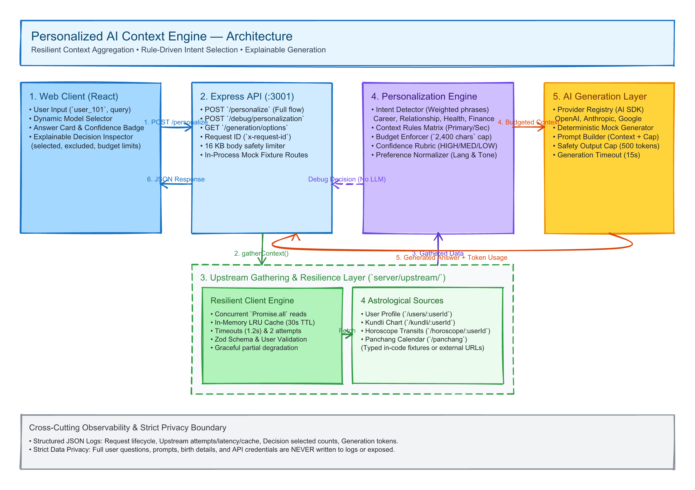

# Personalized AI Context Engine

An explainable TypeScript MVP that gathers mock astrological context, selects the fields relevant to a question, and shows both a generated answer and the decision behind it.

## Run Instructions

Requires Node.js 20 or later.

```bash
npm install
cp .env.example .env
npm run dev
```

Open `http://localhost:5173` and use `user_101`. The API runs at `http://localhost:3001`. Deterministic User Profile, Kundli, Horoscope, and Panchang fixtures are defined in TypeScript and are available immediately at startup.

## Commands

- `npm run dev` — run the Express API and Vite UI
- `npm run typecheck` — check browser and server TypeScript
- `npm run build` — type-check and create production client/server bundles
- `npm start` — run the built API after `npm run build`

## Architecture Diagram

[](docs/architecture-diagram.excalidraw)

The diagram above is available as an editable [Excalidraw source](docs/architecture-diagram.excalidraw). See [architecture notes](docs/architecture.md) for the request flow, confidence rubric, operations, and privacy boundary.

## Environment

Copy `.env.example` for the full list. The main groups are:

- Server and UI: `PORT`, `WEB_ORIGIN`
- Upstreams: `UPSTREAM_BASE_URL` or service-specific URL overrides. User-specific overrides may contain a `{userId}` placeholder or end in `/` to append the encoded user ID.
- Resilience: timeout, attempt, backoff, cache TTL, and cache-capacity settings
- Personalization: `RESPONSE_MAX_WORDS` and `CONTEXT_MAX_CHARS`
- Generation: `GENERATION_MODE`, `AI_PROVIDER`, `AI_MODEL`, per-provider model allowlists and credentials, generation timeout, and output-token cap

The server loads `.env` automatically. Restart it after changing provider credentials or model allowlists because generation options are assembled at startup. If the UI shows “Mock only,” no real provider currently has both a credential and at least one allowlisted model.

## API

`POST /debug/personalization` accepts the unchanged request below. `POST /personalize` also accepts an optional `generation` selection; omitting it uses the server default.

```json
{ "userId": "user_101", "question": "What should I focus on to grow in my career?" }
```

```json
{ "userId": "user_101", "question": "What should I focus on to grow in my career?", "generation": { "provider": "mock", "model": "deterministic" } }
```

Discover valid choices with `GET /generation/options` (or `/api/generation/options`). The response contains `defaultSelection` plus providers and their allowlisted models; it never includes credentials or base URLs. Unknown or unavailable pairs return `INVALID_GENERATION_SELECTION` before upstream context is gathered. Successful answers include the authoritative `provider`, `model`, and `mode` used.

The debug endpoint runs the same context decision without generation. In-code mock service fixtures are available at `GET /users/:userId`, `/kundli/:userId`, `/horoscope/:userId`, and `/panchang`. `/api/mock/*` aliases support the default internal service base. The three user-specific routes return data only for `user_101`; unknown users return a structured `NOT_FOUND` response. Set `UPSTREAM_BASE_URL` to replace their common base address or use the service-specific URL variables.

The weighted phrase configuration supports career, relationship, health, finance, and mixed-topic questions, with a general fallback. Matching is deterministic: ties use the documented intent order, and mixed matches union fields before applying the primary-first `CONTEXT_MAX_CHARS` budget. Add phrases in `server/personalization/intent.ts`, fields in the centralized catalog, and mappings in `server/personalization/rules.ts`.

Useful samples include “What should I focus on to grow in my career?”, “How can I bring more patience to my relationship?”, “What routines could support my health and energy?”, “How should I approach my financial priorities?”, “How can I balance career growth with my relationship?”, and the general “What themes should I keep in mind right now?”.

Profile language and tone are normalized to supported values, falling back to English and supportive. The phrase classifier is intentionally limited with unusual wording and multilingual questions; response language preferences do not make classification multilingual. Confidence means coverage of expected context, including budget omissions. Sources identify context supplied to generation, rather than claims cited in the prose. Birth details, subscription behavior, conversation history, precise timeframe matching, and guaranteed predictions are outside this MVP.

## Resilience and cache

All four upstream reads start concurrently. Each uses `UPSTREAM_TIMEOUT_MS`, `UPSTREAM_MAX_ATTEMPTS`, and `UPSTREAM_RETRY_BACKOFF_MS`; network errors, rate limits, and server errors are retried, while permanent client errors and malformed payloads are not. Successful validated payloads enter a bounded in-memory LRU cache for `CACHE_TTL_MS`. User-specific keys include the service and user ID; Panchang has one global key. Failures are never cached as successes.

To demonstrate partial failure locally, stop the server and restart it with one explicit service URL unavailable, such as `HOROSCOPE_SERVICE_URL=http://127.0.0.1:9 npm run dev:server`. For a career request, set Horoscope, Kundli, and Panchang URLs to that address to demonstrate an all-relevant-source failure; Panchang is otherwise valid secondary career context. Use a fresh process so previous cache entries cannot satisfy the read. Repeating a successful request shows `cache: "hit"` events in the structured server logs.

## Answer generation

`GENERATION_MODE=mock` is the credential-free default and is visibly disclosed in every answer. Its deterministic prose is useful for demonstrating selection, not evaluating answer quality. When `OPENAI_API_KEY` is present, the dropdown defaults to the cost-conscious `gpt-5-nano`, `gpt-5.6-luna`, and `gpt-5-mini`; set `OPENAI_MODELS` to override that allowlist. Anthropic and Google are exposed only when both their credential and comma-separated model allowlist are set: `ANTHROPIC_API_KEY` + `ANTHROPIC_MODELS`, or `GOOGLE_GENERATIVE_AI_API_KEY` + `GOOGLE_MODELS`. `GENERATION_MODE=real`, `AI_PROVIDER`, and `AI_MODEL` select the backward-compatible default when that pair is available. `OPENAI_BASE_URL` can point the OpenAI adapter at a compatible endpoint.

The Vercel AI SDK provider registry resolves `provider:model` identifiers behind the generation boundary. Mock remains an explicit `mock / deterministic` option. A selected real provider failure returns `GENERATION_UNAVAILABLE` and never falls back to mock.

Generation uses a separate `GENERATION_MAX_OUTPUT_TOKENS` safety cap and `GENERATION_TIMEOUT_MS`; the configured response word target remains a user-facing instruction rather than a token limit. A configured real request never falls back to mock output when configuration or provider calls fail. Those failures return a safe `GENERATION_UNAVAILABLE` response with the request ID. Structured logs record prompt size, latency, estimated input tokens in mock mode, and measured provider usage when available, without recording questions, prompts, credentials, or birth data.

## Assumptions

- The in-code fixtures and deterministic mock generator are the credential-free MVP demonstration path.
- Real provider generation is available only when valid local credentials and an allowlisted model are configured.
- The published GitHub repository is the submission artifact; use **Code → Download ZIP** for a source archive.

## Trade-offs

- Configuration-driven phrase matching is explainable and deterministic, but intentionally limited for unusual or multilingual wording.
- The 2,400-character context budget keeps prompts inspectable; it approximates, rather than measures, input tokens.
- The in-memory cache is appropriate for a single-process demo; shared production caching and invalidation are outside this MVP.
